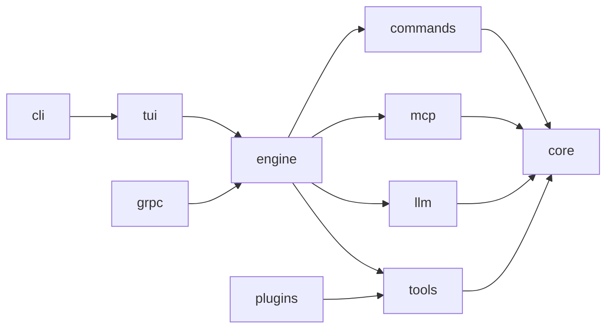
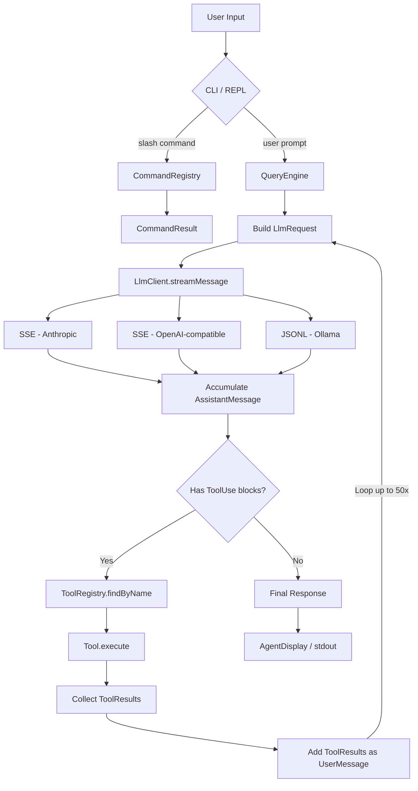

# Architecture

## System Overview

OpenClaude Java is a 10-module Gradle project that implements a coding agent. The agent operates in a loop: it sends conversation messages to an LLM, the LLM responds with text and/or tool calls, the agent executes those tool calls, feeds results back, and repeats until the LLM has no more tool calls.

## Module Dependency Graph



All modules depend on **core** (data models, config, permissions, sessions). The **engine** orchestrates the agent loop using **llm** (LLM clients), **tools** (tool execution), **mcp** (remote MCP tools), and **commands** (slash commands). The **tui** provides the interactive terminal, while **cli** is the entry point that wires everything together.

## Request Flow



## Sealed Data Model Hierarchy

The type system is built on Java sealed interfaces with records. This enables exhaustive pattern matching throughout the codebase.

### Message

```java
sealed interface Message {
    Role role();
    List<ContentBlock> content();

    record UserMessage(List<ContentBlock> content) implements Message
    record AssistantMessage(List<ContentBlock> content, String stopReason, Usage usage) implements Message
}
```

### ContentBlock

```java
sealed interface ContentBlock {
    record Text(String type, String text) implements ContentBlock
    record Thinking(String type, String thinking) implements ContentBlock
    record ToolUse(String type, String id, String name, JsonNode input) implements ContentBlock
    record ToolResult(String type, String toolUseId, String content, boolean isError) implements ContentBlock
}
```

### StreamEvent

```java
sealed interface StreamEvent {
    record MessageStart(String messageId, String model, Usage usage)
    record TextDelta(String text)
    record ThinkingDelta(String thinking)
    record ToolUseStart(String id, String name)
    record ToolInputDelta(String partialJson)
    record ContentBlockStop(int index)
    record MessageComplete(Message.AssistantMessage message)
    record MessageDelta(String stopReason, Usage usage)
    record Error(String message, Exception cause)
}
```

### EngineEvent

```java
sealed interface EngineEvent {
    record Stream(StreamEvent event)
    record ToolExecutionStart(String toolName, String toolUseId)
    record ToolExecutionEnd(String toolName, String toolUseId, ToolResult result)
    record Done(Usage totalUsage, int loopCount)
    record Error(String message)
}
```

### Usage

```java
record Usage(int inputTokens, int outputTokens, int cacheCreationInputTokens, int cacheReadInputTokens) {
    static final Usage ZERO;
    Usage add(Usage other);
    int totalTokens();
}
```

## Key Design Patterns

### Sealed Interfaces + Records

All data models use sealed interfaces with records. This provides:
- Exhaustive pattern matching via `switch` expressions
- Immutability by default
- No null-reference class hierarchies

### No External HTTP Library

All LLM clients use `java.net.http.HttpClient` directly. SSE and JSONL parsing is implemented inline. This keeps the dependency footprint minimal.

### Jackson for JSON

`ObjectMapper` and `JsonNode` are used for all JSON serialization. Tool input schemas are `JsonNode` trees, and LLM API payloads are built using Jackson's `ObjectNode` API.

### Configuration via Environment Variables

`AppConfig.load()` reads provider configuration entirely from environment variables. There are no config files for provider settings (MCP servers use JSON config files separately).

### Adapter Pattern for MCP Tools

MCP tools are exposed as native `Tool` instances via `McpToolBridge`. This means the agent loop does not need to know whether a tool is built-in, from a plugin, or from an MCP server.

### Functional Event Handling

Streaming is implemented via `Consumer<StreamEvent>` and `Consumer<EngineEvent>` callbacks. The `QueryEngine` emits events; consumers (REPL display, print mode, headless server) handle them independently.
