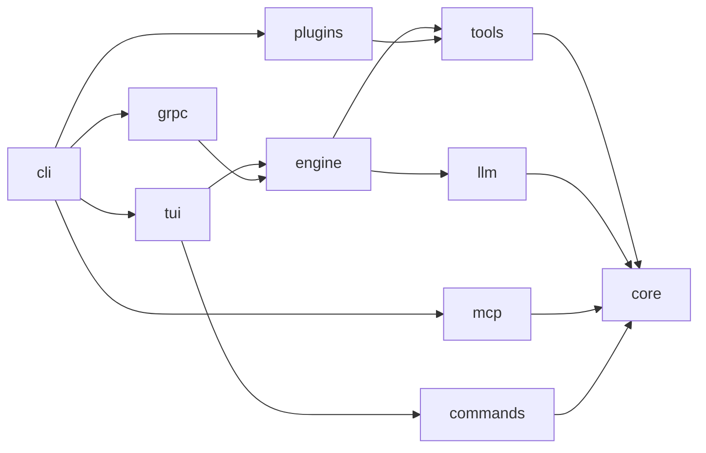
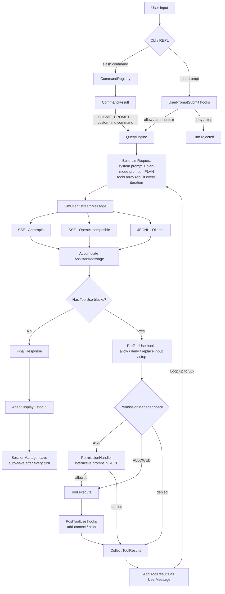

# Architecture

## System Overview

OpenClaude Java is a 10-module Gradle project that implements a coding agent. The agent operates in a loop: it sends conversation messages to an LLM, the LLM responds with text and/or tool calls, the agent executes those tool calls, feeds results back, and repeats until the LLM has no more tool calls.

Around that core loop sit three gates and a persistence layer:

- **Hooks** — user-configured shell commands (`settings.json#hooks`) run at `UserPromptSubmit`, `PreToolUse`, and `PostToolUse`, and can inject context, rewrite tool input, deny an action, or stop the session.
- **Permissions** — every tool call passes through `PermissionManager` (mode + allow/deny lists); an `ASK` decision is resolved interactively in the REPL.
- **Plan mode** — a permission mode (`PermissionMode.PLAN`) that restricts the agent to read-only tools, appends a dedicated planning system prompt, and exits only through the `ExitPlanMode` tool with user approval.
- **Sessions** — the full conversation is auto-saved to `~/.claude/sessions/` after every turn and can be resumed with `--continue` / `--resume`.

## Module Dependency Graph



All modules depend on **core** (data models, config, hooks, permissions, sessions). The **engine** orchestrates the agent loop using **llm** (LLM clients) and **tools** (tool execution). MCP tools reach the engine indirectly: **cli** connects to servers via **mcp** and registers bridged tools into the shared `ToolRegistry`. The **tui** provides the interactive terminal and dispatches slash commands via **commands**, while **cli** is the entry point that wires everything together.

## Request Flow



At any point during a turn, Ctrl+C (REPL) triggers `QueryEngine.requestAbort()`: the loop stops at the next checkpoint, the partial assistant message is dropped, and any already-started tool batch is completed with synthetic "Interrupted by user" tool results so the persisted history stays API-valid (every `tool_use` keeps a `tool_result`).

## Sealed Data Model Hierarchy

The type system is built on Java sealed interfaces with records. This enables exhaustive pattern matching throughout the codebase.

### Message

```java
sealed interface Message {
    Role role();
    List<ContentBlock> content();

    record UserMessage(List<ContentBlock> content) implements Message
    record AssistantMessage(List<ContentBlock> content, String stopReason, Usage usage) implements Message
}
```

### ContentBlock

```java
sealed interface ContentBlock {
    record Text(String type, String text) implements ContentBlock
    record Thinking(String type, String thinking) implements ContentBlock
    record ToolUse(String type, String id, String name, JsonNode input) implements ContentBlock
    record Image(String type, Source source) implements ContentBlock          // base64 image (multimodal FileRead)
    record ToolResult(String type, String toolUseId,
                      List<ContentBlock> content, boolean isError) implements ContentBlock
}
```

`ToolResult.content` is a list of blocks (not a plain string) so tool output can be multimodal — e.g. `FileReadTool` returns `Image` blocks for image files and notebook outputs. `textContent()` concatenates the inner `Text` blocks when a string view is needed (hooks, display).

### StreamEvent

```java
sealed interface StreamEvent {
    record MessageStart(String messageId, String model, Usage usage)
    record TextDelta(String text)
    record ThinkingDelta(String thinking)
    record ToolUseStart(String id, String name)
    record ToolInputDelta(String partialJson)
    record ContentBlockStop(int index)
    record MessageComplete(Message.AssistantMessage message)
    record MessageDelta(String stopReason, Usage usage)
    record Error(String message, Exception cause)
}
```

### EngineEvent

```java
sealed interface EngineEvent {
    record Stream(StreamEvent event)
    record ToolExecutionStart(String toolName, String toolUseId)
    record ToolExecutionEnd(String toolName, String toolUseId, ToolResult result)
    record Done(Usage totalUsage, int loopCount)
    record BackgroundAgentDone(String description, String result)
    record Error(String message)
    record Aborted()
}
```

### HookDecision

```java
sealed interface HookDecision {
    record Allow(String additionalContext)   // proceed; optional context injected into next turn
    record Deny(String reason)               // abort this action (tool call or prompt)
    record Stop(String stopReason)           // abort the whole session
    record ReplaceInput(JsonNode newInput)   // PreToolUse only: rewrite tool_input
}
```

### Usage

```java
record Usage(int inputTokens, int outputTokens, int cacheCreationInputTokens, int cacheReadInputTokens) {
    static final Usage ZERO;
    Usage add(Usage other);
    int totalTokens();
}
```

## Hooks

Hooks let users run shell commands at lifecycle points, following Claude Code's hook protocol. Configuration lives under the `hooks` key in `settings.json`, merged from `~/.claude/settings.json` (user) then `<cwd>/.claude/settings.json` (project, overrides user) by `HooksConfigLoader`.

`HookExecutor` (in `core.hooks`) runs the matching commands for an event, writing a JSON payload to the hook's stdin and parsing its stdout into a `HookDecision`. Exit-code semantics match Claude Code: only exit code 2 is a blocking error; any other non-zero exit is non-blocking (stderr is surfaced, execution continues).

Wired dispatch sites (the `HookEvent` enum declares more for future use):

| Event | Dispatched from | Can do |
|-------|----------------|--------|
| `UserPromptSubmit` | `Repl` before each turn | Add context, deny the prompt, stop the session |
| `PreToolUse` | `QueryEngine` before each tool call | Add context, deny the call, replace `tool_input`, stop |
| `PostToolUse` | `QueryEngine` after each tool call | Add context, stop — **cannot** deny (the tool already ran; a `block` response is downgraded to feedback) |

When a hook stops the session mid-tool-batch, remaining tool calls receive synthetic error `tool_result` blocks so the conversation stays API-valid. Hooks also propagate into sub-agents via `SubAgentRunner`.

## Permissions

`PermissionManager` combines a mode with per-tool always-allow/always-deny lists (list rules win over the mode). `check(toolName, isReadOnly)` returns `ALLOWED`, `DENIED`, or `ASK`:

| Mode | Read-only tool | Mutating tool |
|------|---------------|---------------|
| `DEFAULT` | ALLOWED | ASK |
| `PLAN` | ALLOWED | DENIED |
| `AUTO_APPROVE` | ALLOWED | ALLOWED |
| `AUTO_DENY` | ALLOWED | DENIED |

An `ASK` decision is resolved by a `PermissionHandler` (engine-level interface). The REPL installs `ReplPermissionHandler`, which renders a single-keystroke prompt: `y` allow once, `a` always allow this tool, `A` switch to `AUTO_APPROVE`, anything else deny once. In non-interactive contexts (print mode, headless server) there is no handler, so `ASK` degrades to `DENIED` — those modes run with `AUTO_APPROVE` (print with `--dangerously-skip-permissions`) or `AUTO_DENY` accordingly.

### Plan Mode

`PermissionMode.PLAN` (entered via `/permissions plan`) turns the agent into a read-only planner:

- The permission table above blocks all mutating tools.
- `QueryEngine` appends a dedicated plan-mode system prompt on **every** iteration (resolved per-iteration so approval mid-run takes effect immediately).
- The model finishes by calling the `ExitPlanMode` tool with the plan in markdown. The tool is `isReadOnly()` so the PLAN gate lets it run; the REPL renders the plan and asks for approval. Approving switches the mode back to `DEFAULT`; rejecting keeps `PLAN`. Without an interactive approval handler the tool refuses to exit plan mode.

## Sessions

`SessionManager` holds the conversation (messages, usage, turn count) and persists it as JSON to `~/.claude/sessions/session-<id>.json`. Serialization of the sealed `Message`/`ContentBlock` hierarchy is handled by `SessionCodec` (Anthropic API wire format with a `type` discriminator).

- **Auto-save**: the REPL saves after every turn, atomically (temp file + move), so a crash never loses the conversation or corrupts the previous snapshot.
- **Resume**: `--continue` loads the most recently modified session file; `--resume <sessionId>` loads a specific one. The REPL then continues the conversation with full history.
- **History across turns**: `QueryEngine.run(history, prompt)` copies the prior messages and returns the full updated conversation; the REPL keeps one engine per session so per-session tool state (e.g. files-read tracking for `FileWriteTool`) survives across turns.

## System Prompt Assembly

The effective system prompt is composed at startup and per-iteration:

1. Base system prompt (`--system` flag or default).
2. `ClaudeMdLoader` prefix — concatenates `~/.claude/CLAUDE.md`, `<cwd>/.claude/CLAUDE.md`, and `<cwd>/CLAUDE.md` (most general first). Disable with `--no-claude-md` or `OPENCLAUDE_DISABLE_CLAUDE_MD`.
3. Plan-mode prompt — appended by `QueryEngine` each iteration while `PermissionMode.PLAN` is active.

## Extensibility from Markdown

Two loaders extend the agent from `.claude/` directories without code:

- **Custom slash commands** — `CustomCommandLoader` scans `~/.claude/commands/*.md` (user) and `<cwd>/.claude/commands/*.md` (project overrides user). Frontmatter supports `description`, `argument-hint`, and `allowed-tools`; invoking the command returns `CommandResult.submitPrompt(...)`, which the REPL runs as an agent turn — on a tool-restricted registry copy when `allowed-tools` is set.
- **Custom sub-agents** — `MarkdownSubAgentLoader` scans `~/.claude/agents/*.md` and `<cwd>/.claude/agents/*.md` into a `SubAgentRegistry` (project > user > built-in on name collisions). Built-ins are `general-purpose`, `Explore` (read-only), and `Plan` (no file writes). Frontmatter supports `name`, `description`, `tools` (whitelist), and `model` (alias or full ID).

## Workspace State

Each `QueryEngine` owns a `WorkspaceState` — a mutable cwd shared with every tool via `ToolUseContext.workspace()`. Normally it points at the original working directory, but the `EnterWorktree`/`ExitWorktree` tools can move the whole session into a temporary git worktree and back at runtime; `ToolUseContext.workingDirectory()` always reflects the current location.

## Key Design Patterns

### Sealed Interfaces + Records

All data models use sealed interfaces with records. This provides:
- Exhaustive pattern matching via `switch` expressions
- Immutability by default
- No null-reference class hierarchies

### No External HTTP Library

All LLM clients use `java.net.http.HttpClient` directly. SSE and JSONL parsing is implemented inline. This keeps the dependency footprint minimal.

### Jackson for JSON

`ObjectMapper` and `JsonNode` are used for all JSON serialization. Tool input schemas are `JsonNode` trees, and LLM API payloads are built using Jackson's `ObjectNode` API.

### Configuration via Environment Variables

`AppConfig.load()` reads provider configuration entirely from environment variables. There are no config files for provider settings. JSON config files are used for other concerns: MCP servers (`.mcp.json`), hooks and notifications (`settings.json`).

### Adapter Pattern for MCP Tools

MCP tools are exposed as native `Tool` instances via `McpToolBridge`. This means the agent loop does not need to know whether a tool is built-in, from a plugin, or from an MCP server. Transports are pluggable behind `McpTransportClient`: `StdioTransport` (local subprocess) and `HttpSseTransport` (remote HTTP+SSE, interoperating with streamable-HTTP servers).

### Deferred Tool Schemas

When the tool catalog exceeds `OPENCLAUDE_TOOL_SEARCH_THRESHOLD` (default 25), MCP tools are registered deferred in the `ToolRegistry`: excluded from the API tools array, listed as a name+summary index inside the `ToolSearch` tool's dynamic description. `ToolSearch(query)` activates matches; because `QueryEngine` rebuilds the tools array every iteration, activated tools become callable on the next LLM call.

### Functional Event Handling

Streaming is implemented via `Consumer<StreamEvent>` and `Consumer<EngineEvent>` callbacks. The `QueryEngine` emits events; consumers (REPL display, print mode, headless server) handle them independently.
