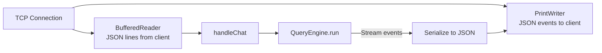

# Headless Server Mode

OpenClaude Java can run as a headless JSON-over-TCP server, allowing other applications to embed the coding agent.

## Starting the Server

```bash
# Default port (9818)
./gradlew :cli:run --args="--serve"

# Custom port
./gradlew :cli:run --args="--serve --port 8080"
```

The server listens for TCP connections and handles each client in a separate thread via `CachedThreadPool`.

## Protocol

**Newline-delimited JSON** over TCP. Each message is a single JSON object followed by a newline (`\n`).

### Client -> Server

#### Chat Request

```json
{"type": "chat", "message": "Create a hello world program", "working_directory": "/home/user/project"}
```

| Field | Type | Required | Description |
|-------|------|----------|-------------|
| `type` | string | yes | `"chat"` |
| `message` | string | yes | User prompt |
| `working_directory` | string | no | Working directory (defaults to server's cwd) |

#### Cancel Request

```json
{"type": "cancel"}
```

> Note: Cancel is not yet implemented. The server responds with an error message.

### Server -> Client

Events are streamed as the agent works:

#### Text Delta

```json
{"type": "text", "text": "Here's a hello world program..."}
```

Incremental text from the LLM response. Concatenate all `text` events to build the full response.

#### Tool Start

```json
{"type": "tool_start", "tool_name": "Write", "tool_use_id": "toolu_abc123"}
```

Emitted when the agent begins executing a tool.

#### Tool Result

```json
{"type": "tool_result", "tool_name": "Write", "output": "File written successfully.", "is_error": false, "tool_use_id": "toolu_abc123"}
```

Emitted when a tool finishes executing.

#### Done

```json
{"type": "done", "input_tokens": 1234, "output_tokens": 567}
```

Emitted when the agent loop completes (no more tool calls).

#### Error

```json
{"type": "error", "message": "API key not found."}
```

Emitted on errors.

## Architecture



Each client connection gets a dedicated handler thread. The `QueryEngine` runs the full agent loop, and its `EngineEvent`s are serialized to JSON and written back to the client.

## Example Client (Python)

```python
import socket
import json

def chat(message, host="localhost", port=9818):
    sock = socket.socket(socket.AF_INET, socket.SOCK_STREAM)
    sock.connect((host, port))

    # Send chat request
    request = json.dumps({"type": "chat", "message": message})
    sock.sendall((request + "\n").encode())

    # Read events
    buffer = ""
    full_text = ""
    while True:
        data = sock.recv(4096).decode()
        if not data:
            break
        buffer += data
        while "\n" in buffer:
            line, buffer = buffer.split("\n", 1)
            event = json.loads(line)

            if event["type"] == "text":
                full_text += event["text"]
                print(event["text"], end="", flush=True)
            elif event["type"] == "tool_start":
                print(f"\n[Tool: {event['tool_name']}]", flush=True)
            elif event["type"] == "tool_result":
                status = "error" if event["is_error"] else "ok"
                print(f"[{status}]", flush=True)
            elif event["type"] == "done":
                print(f"\n[Tokens: {event['input_tokens']} in / {event['output_tokens']} out]")
                sock.close()
                return full_text
            elif event["type"] == "error":
                print(f"\nError: {event['message']}")
                sock.close()
                return None

chat("Create a file called hello.py with a hello world program")
```

## Limitations

- No authentication — the server trusts all connections
- No cancel support (planned)
- No conversation persistence across requests — each `chat` message starts a fresh agent loop
- Single conversation per connection at a time
