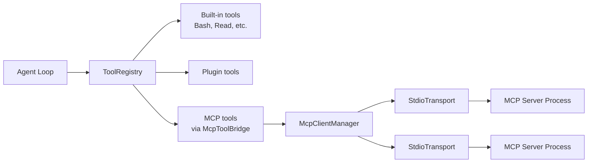

# MCP Integration

OpenClaude Java includes a client for the [Model Context Protocol](https://modelcontextprotocol.io/) (MCP), version 2024-11-05. MCP servers expose tools that the agent can use alongside built-in tools.

## Overview



MCP tools are transparent to the agent — they appear as regular `Tool` instances with the naming convention `mcp__<server>__<tool>`.

## Configuration

MCP servers are configured in JSON files. Two locations are checked (merged in order):

### 1. User-level: `~/.claude/settings.json`

```json
{
  "mcpServers": {
    "filesystem": {
      "type": "stdio",
      "command": "npx",
      "args": ["-y", "@modelcontextprotocol/server-filesystem", "/home/user"],
      "env": {}
    }
  }
}
```

### 2. Project-local: `.mcp.json` (in working directory)

Same format. Project-local entries override user-level entries with the same name.

### Config Fields

| Field | Type | Description |
|-------|------|-------------|
| `type` | string | Transport type: `"stdio"` (only supported currently) |
| `command` | string | Command to spawn the server process |
| `args` | string[] | Command arguments |
| `env` | object | Extra environment variables for the process |
| `url` | string | Server URL (for future remote transport support) |
| `headers` | object | HTTP headers (for future remote transport support) |

### Environment Variable Substitution

Command strings and arguments support `${ENV_VAR}` substitution:

```json
{
  "command": "node",
  "args": ["${HOME}/mcp-servers/my-server/index.js"]
}
```

## Lifecycle

### Connection Flow

1. `McpConfigLoader.load(cwd)` merges configs from both files
2. `McpClientManager.connectAll(configs)` iterates over each config:
   - Creates a `StdioTransport` (spawns the server process)
   - Sends `initialize` JSON-RPC request (protocol version `2024-11-05`, client info)
   - Receives server info and capabilities
   - Sends `notifications/initialized` notification
   - Sends `tools/list` to discover available tools
3. `McpToolBridge.createTools(manager)` wraps each MCP tool as a native `Tool`
4. Tools are registered in the `ToolRegistry`

### Server States

```java
sealed interface McpServer {
    record Connected(String name, McpTransportClient transport,
                     ServerInfo serverInfo, List<McpTool> tools)
    record Failed(String name, String error)
}
```

Failed servers are logged but don't prevent the agent from starting.

### Tool Execution

When the agent calls an MCP tool:

1. `McpToolAdapter.execute()` delegates to `McpClientManager.callTool()`
2. The qualified name is parsed: `mcp__<server>__<tool>` -> server name + tool name
3. A `tools/call` JSON-RPC request is sent to the server's transport
4. The response `content` array is extracted and returned as a `ToolResult`

### Cleanup

`McpClientManager` implements `AutoCloseable`. When closed, all transports are shut down and server processes are terminated.

## Transport

### StdioTransport

The only currently supported transport. Communicates with MCP servers via stdin/stdout of a spawned process.

**Protocol:** JSON-RPC 2.0 over newline-delimited JSON.

- **Requests:** `{"jsonrpc": "2.0", "id": <n>, "method": "...", "params": {...}}`
- **Responses:** `{"jsonrpc": "2.0", "id": <n>, "result": {...}}`
- **Notifications:** `{"jsonrpc": "2.0", "method": "...", "params": {...}}` (no `id`)

Timeout: 30 seconds for initialization and tool calls.

## Tool Naming Convention

MCP tools are named `mcp__<normalizedServer>__<normalizedTool>` where normalization replaces non-alphanumeric characters (except `_`) with underscores and lowercases the result.

Example: A server named `my-filesystem` with a tool `read_file` becomes `mcp__my_filesystem__read_file`.
