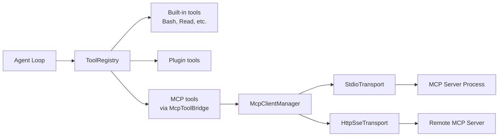

# MCP Integration

OpenClaude Java includes a client for the [Model Context Protocol](https://modelcontextprotocol.io/) (MCP), version 2024-11-05. MCP servers expose tools that the agent can use alongside built-in tools.

## Overview



MCP tools are transparent to the agent — they appear as regular `Tool` instances with the naming convention `mcp__<server>__<tool>`.

## Configuration

MCP servers are configured in JSON files. Two locations are checked (merged in order):

### 1. User-level: `~/.claude/settings.json`

```json
{
  "mcpServers": {
    "filesystem": {
      "type": "stdio",
      "command": "npx",
      "args": ["-y", "@modelcontextprotocol/server-filesystem", "/home/user"],
      "env": {}
    }
  }
}
```

### 2. Project-local: `.mcp.json` (in working directory)

Same format. Project-local entries override user-level entries with the same name.

### Config Fields

| Field | Type | Description |
|-------|------|-------------|
| `type` | string | Transport type: `"stdio"`, `"sse"`, or `"http"`. Optional — a config with only `url` defaults to `"sse"`, otherwise `"stdio"` |
| `command` | string | Command to spawn the server process (stdio) |
| `args` | string[] | Command arguments (stdio) |
| `env` | object | Extra environment variables for the process (stdio) |
| `url` | string | Server URL (sse/http remote servers) |
| `headers` | object | HTTP headers sent on every request, e.g. `{"Authorization": "Bearer ${MY_TOKEN}"}` |

### Remote Servers (HTTP/SSE)

```json
{
  "mcpServers": {
    "internal-api": {
      "url": "https://mcp.example.com/mcp",
      "headers": {"Authorization": "Bearer ${INTERNAL_MCP_TOKEN}"}
    }
  }
}
```

The client implements the MCP 2024-11-05 HTTP+SSE flow (GET opens the SSE stream, the
server announces the POST endpoint via an `endpoint` event, responses arrive as `message`
events) and also interoperates with "streamable HTTP" servers that answer each POST
directly with JSON. The SSE channel reconnects automatically on stream loss (up to 3
attempts).

### Environment Variable Substitution

Command strings, arguments, URLs, and header values support `${ENV_VAR}` substitution:

```json
{
  "command": "node",
  "args": ["${HOME}/mcp-servers/my-server/index.js"]
}
```

## Lifecycle

### Connection Flow

1. `McpConfigLoader.load(cwd)` merges configs from both files
2. `McpClientManager.connectAll(configs)` iterates over each config:
   - Creates the transport for the config's `type`: `StdioTransport` (spawns the server process) or `HttpSseTransport` (remote)
   - Sends `initialize` JSON-RPC request (protocol version `2024-11-05`, client info)
   - Receives server info and capabilities
   - Sends `notifications/initialized` notification
   - Sends `tools/list` to discover available tools
3. `McpToolBridge.createTools(manager)` wraps each MCP tool as a native `Tool`
4. Tools are registered in the `ToolRegistry`

### Server States

```java
sealed interface McpServer {
    record Connected(String name, McpTransportClient transport,
                     ServerInfo serverInfo, List<McpTool> tools)
    record Failed(String name, String error)
}
```

Failed servers are logged but don't prevent the agent from starting.

### Tool Execution

When the agent calls an MCP tool:

1. `McpToolAdapter.execute()` delegates to `McpClientManager.callTool()`
2. The qualified name is resolved via a binding map built at discovery time, which maps `mcp__<server>__<tool>` back to the server and the server's **original** tool name (parsing the qualified name is only a fallback for names unaffected by normalization)
3. A `tools/call` JSON-RPC request is sent to the server's transport, carrying the original tool name — never the normalized one
4. The response `content` array is extracted and returned as a `ToolResult`

### Cleanup

`McpClientManager` implements `AutoCloseable`. When closed, all transports are shut down and server processes are terminated.

## Transports

### StdioTransport

Communicates with MCP servers via stdin/stdout of a spawned process. Used when `type` is `"stdio"` (or when a `command` is configured without a `url`).

**Protocol:** JSON-RPC 2.0 over newline-delimited JSON.

- **Requests:** `{"jsonrpc": "2.0", "id": <n>, "method": "...", "params": {...}}`
- **Responses:** `{"jsonrpc": "2.0", "id": <n>, "result": {...}}`
- **Notifications:** `{"jsonrpc": "2.0", "method": "...", "params": {...}}` (no `id`)

Timeout: 30 seconds for initialization and tool calls.

### HttpSseTransport

Communicates with remote MCP servers over HTTP. Used when `type` is `"sse"` or `"http"` — see [Remote Servers (HTTP/SSE)](#remote-servers-httpsse) above for the protocol details. The same 30-second timeout applies.

## Tool Naming Convention

MCP tools are named `mcp__<normalizedServer>__<normalizedTool>` where normalization replaces non-alphanumeric characters (except `_`) with underscores and lowercases the result.

Example: A server named `my-filesystem` with a tool `read_file` becomes `mcp__my_filesystem__read_file`.

The qualified name is only how the tool appears to the model. `tools/call` requests always carry the server's original tool name, resolved through a binding map — so tools whose names contain characters altered by normalization (e.g. `notion-search`) still work. If two distinct original names collide after normalization, a numeric suffix (`_2`, `_3`, ...) is appended to keep the qualified names unique.

## Deferred Schema Loading (ToolSearch)

With many MCP servers connected, tool schemas can dominate the prompt. When the total tool count (built-in + MCP) exceeds `OPENCLAUDE_TOOL_SEARCH_THRESHOLD` (default 25; set to 0 to disable deferral), MCP tools are registered **deferred**:

- Deferred tools are excluded from the API `tools` array — only a lightweight name + summary index is kept, embedded in the (dynamic) description of a `ToolSearch` tool that is registered instead.
- The model calls `ToolSearch(query)` to activate tools: `select:Name1,Name2` for exact names, or free-text keywords matched against names and descriptions (`max_results` defaults to 5).
- Activated tools are promoted in the `ToolRegistry`; the engine rebuilds the tools array every iteration, so they become callable on the next LLM call.
