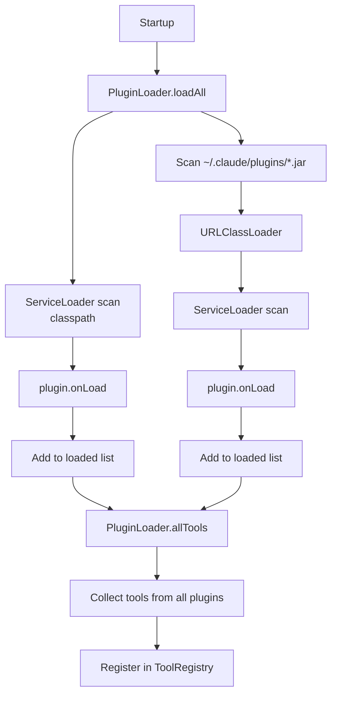

# Plugin System

Plugins extend OpenClaude Java with additional tools. They are discovered at startup via Java's ServiceLoader mechanism.

## Plugin Interface

```java
// plugins/src/main/java/dev/openclaude/plugins/Plugin.java
public interface Plugin {
    String name();
    String version();
    String description();
    List<Tool> tools();
    default void onLoad() {}
    default void onUnload() {}
}
```

| Method | Description |
|--------|-------------|
| `name()` | Unique plugin identifier |
| `version()` | Version string (e.g., `"1.0.0"`) |
| `description()` | Short description |
| `tools()` | List of `Tool` instances to register |
| `onLoad()` | Called when plugin is loaded (initialization) |
| `onUnload()` | Called when plugin is unloaded (cleanup) |

## Discovery

`PluginLoader` discovers plugins from two sources:

### 1. Classpath (ServiceLoader)

Plugins on the classpath are discovered via `ServiceLoader.load(Plugin.class)`. This is used during development when plugins are built as part of the project.

### 2. JAR Directory (`~/.claude/plugins/`)

All `.jar` files in `~/.claude/plugins/` are loaded via a `URLClassLoader`, then scanned with `ServiceLoader`. This is the deployment mechanism for user-installed plugins.

## Lifecycle



On shutdown, `PluginLoader.unloadAll()` calls `onUnload()` on each plugin.

## Creating a Plugin

### 1. Create the project

Create a new Java project (Gradle or Maven) that depends on the `tools` module:

```kotlin
// build.gradle.kts
dependencies {
    compileOnly("dev.openclaude:tools:0.1.0-SNAPSHOT")
}
```

### 2. Implement the Plugin interface

```java
package com.example.myplugin;

import dev.openclaude.plugins.Plugin;
import dev.openclaude.tools.Tool;
import java.util.List;

public class MyPlugin implements Plugin {

    @Override
    public String name() { return "my-plugin"; }

    @Override
    public String version() { return "1.0.0"; }

    @Override
    public String description() { return "Adds custom tools."; }

    @Override
    public List<Tool> tools() {
        return List.of(new MyCustomTool());
    }

    @Override
    public void onLoad() {
        System.out.println("My plugin loaded!");
    }
}
```

### 3. Implement your tool(s)

See [Tool System - Creating a Custom Tool](tools.md#creating-a-custom-tool).

### 4. Register with ServiceLoader

Create the file `src/main/resources/META-INF/services/dev.openclaude.plugins.Plugin`:

```
com.example.myplugin.MyPlugin
```

### 5. Build and deploy

```bash
# Build the JAR
./gradlew jar

# Copy to the plugins directory
cp build/libs/my-plugin.jar ~/.claude/plugins/
```

The plugin will be loaded automatically on the next OpenClaude startup.

## Error Handling

- If a plugin's `onLoad()` throws an exception, it is skipped with a warning
- If a plugin's `tools()` throws, it is skipped with a warning
- Plugin loading errors do not prevent the agent from starting
